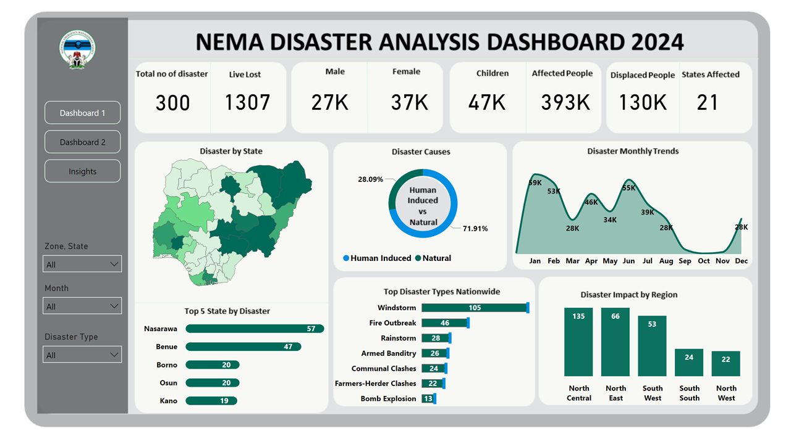
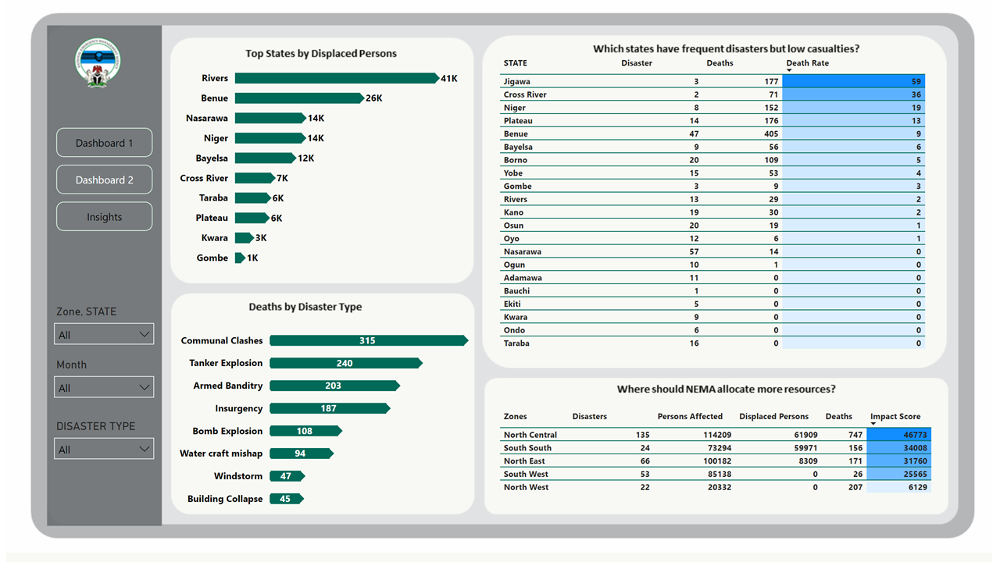
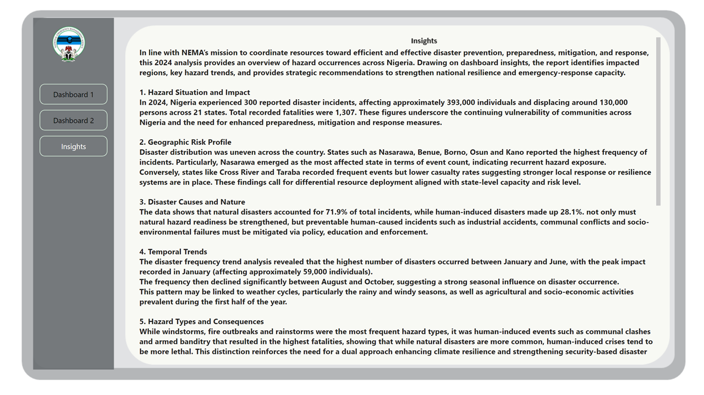

# NEMA 2024 Disaster Analysis Dashboard (Power BI)

## Overview
This project analyzes Nigeria’s 2024 disaster incidents using Power BI.  
I obtained the dataset during my NYSC service at the **National Emergency Management Agency (NEMA)**, where I had access to internal disaster occurrence records.  

The goal of this dashboard is to transform raw operational data into actionable insights that support disaster preparedness, response planning, and resource allocation.

---

## Objectives
- Clean and model the disaster dataset for analytics.
- Identify high-risk states and geopolitical zones.
- Analyze seasonal patterns in disaster occurrence.
- Provide data-driven recommendations for emergency management.

---

## Tools Used
- **Power BI** (Visuals, DAX, Reports)
- **Power Query** (Data cleaning & shaping)
- **Excel** (Initial exploratory checks)

---
## Dashboard

---

## Data Model
Key fields include:
- Disaster Type  
- Date of Occurrence  
- Number of Persons Affected  
- Number of Displaced Persons  
- Fatalities  
- State & Region  

A structured data model was created to support calculations, trend analysis, and drill-down features.

---

## Dashboard Features
- **Disaster Overview:** Total incidents, affected persons, displaced persons, and fatalities.
- **Geographic Heatmap:** Identifies states with the highest disaster frequency.
- **Monthly Trend Chart:** Shows seasonal peaks and event distribution across months.
- **Disaster Type Breakdown:** Understanding the prevalence of different hazard categories.
- **Insights Page:** Concise analytics summarizing patterns and risk hotspots.

---

## Key Insights
- Some states show consistently high hazard exposure, requiring increased preparedness.
- Seasonal patterns indicate peak disaster months driven by climate cycles.
- Flood-related incidents remain significant across multiple regions.
- Low-reporting states may need strengthened field data collection.

---

## Recommendations
- Enhance **early warning systems** in high-risk zones.
- Allocate more **logistics and response assets** to the most affected regions.
- Strengthen **community-based preparedness programs**.
- Improve **data capture and reporting systems** across states.
- Conduct annual reviews to support long-term disaster risk reduction.

---

## How to Use
1. Clone or download the repository.  
2. Open the `.pbix` file in Power BI Desktop.  
3. Navigate the pages to explore the dashboard.

---

## Author
**Edifonini Godwin**  
Data Analyst 

